# nest-forge

Extract loop-/map-nests from a DaCe SDFG, re-emit each as a standalone numpy reference + YAML config,
farm them out to OptArena's translator to produce C / C++ / Fortran variants, compile each across a
compiler × flag × FP-mode matrix, benchmark against generated data, pick the best per nest, link winners
into the full program, and compare against baselines. A DaCe backend competes in the same arena.

Everything lives here and plugs into DaCe through its external-transformation registry; DaCe itself
stays unmodified.

## Quick start

```bash
# 1. clone nest-forge and OptArena as siblings (SSH; needs read access to spcl/OptArena)
git clone git@github.com:spcl/NestForge.git && cd NestForge
git clone git@github.com:spcl/OptArena.git ../optarena   # sibling checkout next to ./nest-forge

# 2. DaCe `extended` as a sibling checkout, then the editable deps + test/format tools
git clone -b extended git@github.com:spcl/dace.git ../dace   # or: git -C ../dace switch extended
pip install -r requirements-dev.txt               # -e ../dace, -e ../optarena, pytest, yapf, ...

# 3. run the unit suite (must pass with zero skips)
pytest -m "not integration"
```

## Plot the results

The plotters are **readers** — they never recompile, just render the per-kernel JSON a benchmark run
left under `perf_results/`. After a run (or `--tables-only` merge), from the repo root:

```bash
python perf/plot_winners.py      --results-dir perf_results/tsvc_full          # single-compiler vs nest-forge best (+ per-kernel winner)
python perf/plot_overhead.py     --results-dir perf_results/staticlib_overhead # static-lib COMPILE overhead (external .a / monolithic)
python perf/plot_calloverhead.py --results-dir perf_results/calloverhead       # runtime CALL overhead (external .a vs LTO-.a vs inline)
```

Each writes a `.png` next to the results plus a machine-readable `.csv`. The daint job (below) renders all
three automatically in its last phase.

## Submit the benchmark jobs (CSCS Alps / daint)

The whole benchmark is **one phased SLURM job** (`perf/daint_all.sh`). `submit_all.sh` gates the full run
behind a quick smoke, so a broken pipeline fails in ~40 min instead of after 24 h:

```bash
bash perf/submit_all.sh            # smoke (40 min) -> full run only if the smoke succeeds
SMOKE=0 bash perf/submit_all.sh    # full run only (skip the smoke gate)
REPS=5 COMPILERS=gcc bash perf/submit_all.sh   # any daint_all.sh knob passes straight through
```

`perf/daint_all.sh` phases (each toggled by `RUN_<PHASE>=0|1`, all on by default):

1. **full matrix** (`nestforge.perf.tsvc_full`) — every TSVC kernel (tsvc2 + tsvc2.5) swept over
   opt-mode `{simplify-parallel, canonicalize, auto-opt}` × language `{c, c++, fortran}` × `{sequential, auto-par}` ×
   compiler × cost-model `{default, cheap, no-vec}` × FP `{default-fp, no-fast-errno}`, plus a
   strict-ieee correctness gate. Median-of-5 timing at the `PROF` size (working set > L3 → memory-bound);
   compared against the native `.cpp` baseline and the DaCe-cpp lane.
2. **cross-language XL** (`nestforge.perf.crosslang_xl`) — the same kernels at the XL problem size.
3. **static-lib compile overhead** (`nestforge.perf.staticlib_overhead`) — monolithic vs external `.a` compile time.
4. **runtime call overhead** (`nestforge.perf.calloverhead`) — the stateless emitted kernel built + timed
   three ways: inlined (`#include`), external fat-LTO `.a` (the linker inlines it back from the archive),
   and external plain `.a` (an out-of-line call). Reports `external / inline` (the call cost) and
   `external-lto / inline` (~1.0 = LTO recovered it).
5. **plots** (rank 0) — `perf/plot_winners.py`, `perf/plot_overhead.py`, `perf/plot_calloverhead.py`.

Knobs (all `${VAR:-default}`): `COMPILERS` (auto), `REPS` (5), `PROFILE_PRESET` (PROF), `LANGUAGES`,
`CROSSLANG_LANGUAGES`, `COST_MODELS`, `FP_MODES`, `CALLOVERHEAD_INNER`/`CALLOVERHEAD_REPS`, and the phase
toggles `RUN_FULL`/`RUN_CROSSLANG`/`RUN_OVERHEAD`/`RUN_CALLOVERHEAD`/`RUN_PLOTS`. Results land under
`<repo>/perf_results/` — the job resolves the repo root from its own location (override with `NF_REPO`),
so the clone name (`NestForge`, `nest-forge`, …) does not matter. Merge the per-rank tables with
`--tables-only`, e.g. `python -m nestforge.perf.tsvc_full --tables-only --out perf_results/tsvc_full`. Full
matrix, sizing rationale, multi-rank partitioning, and the cmake-hang mitigation are in
`perf/README_tsvc_full.md`.

<!-- AXES:BEGIN -->
## Configuration space

_Generated by `python -m nestforge.perf.render_axes --write` from the live axis constants (`tsvc.OPT_MODES`, `flags.COST_MODELS`/`PARALLEL_MODES`/`REDUCED_FP_MODES`/`VECLIBS`, `build.CODEGEN_IMPLS`). A test regenerates and compares, so it cannot drift._

```mermaid
graph TD
  ARENA["Arena (per loop nest)"]
  ARENA --> L0["native original.cpp reference<br/>24 cells"]
  L0 --> L0A0["language"]
  L0A0 --> L0A0V0["c++"]
  L0 --> L0A1["compiler"]
  L0A1 --> L0A1V0["gcc"]
  L0A1 --> L0A1V1["clang"]
  L0A1 --> L0A1V2["nvhpc"]
  L0A1 --> L0A1V3["intel"]
  L0 --> L0A2["cost-model"]
  L0A2 --> L0A2V0["default"]
  L0A2 --> L0A2V1["cheap"]
  L0A2 --> L0A2V2["no-vec"]
  L0 --> L0A3["fp"]
  L0A3 --> L0A3V0["default-fp"]
  L0A3 --> L0A3V1["no-fast-errno"]
  ARENA --> L1["DaCe-cpp baseline (speedup denominator)<br/>2 cells"]
  L1 --> L1A0["codegen-impl"]
  L1A0 --> L1A0V0["experimental"]
  L1A0 --> L1A0V1["legacy"]
  L1 --> L1A1["fp"]
  L1A1 --> L1A1V0["strict-ieee"]
  ARENA --> L2["nest-forge external-nest sweep<br/>1296 cells"]
  L2 --> L2A0["opt-mode"]
  L2A0 --> L2A0V0["simplify-parallel"]
  L2A0 --> L2A0V1["canonicalize"]
  L2A0 --> L2A0V2["auto-opt"]
  L2 --> L2A1["language"]
  L2A1 --> L2A1V0["c"]
  L2A1 --> L2A1V1["c++"]
  L2A1 --> L2A1V2["fortran"]
  L2 --> L2A2["parallel"]
  L2A2 --> L2A2V0["sequential"]
  L2A2 --> L2A2V1["auto-par"]
  L2A2 --> L2A2V2["omp-emit"]
  L2 --> L2A3["compiler"]
  L2A3 --> L2A3V0["gcc"]
  L2A3 --> L2A3V1["clang"]
  L2A3 --> L2A3V2["nvhpc"]
  L2A3 --> L2A3V3["intel"]
  L2 --> L2A4["cost-model"]
  L2A4 --> L2A4V0["default"]
  L2A4 --> L2A4V1["cheap"]
  L2A4 --> L2A4V2["no-vec"]
  L2 --> L2A5["fp"]
  L2A5 --> L2A5V0["default-fp"]
  L2A5 --> L2A5V1["no-fast-errno"]
  L2 --> L2A6["veclib"]
  L2A6 --> L2A6V0["none"]
  L2A6 --> L2A6V1["«device winner»"]
  L2 --> L2A7["vectorization"]
  L2A7 --> L2A7V0["«ISA x width x strategy (per-device staged select)»"]
```


<!-- AXES:END -->

## Layout
```
nestforge/
  extract.py      extract_nest_to_sdfg(parent_sdfg, node) -> (standalone_sdfg, Boundary)
  strategies.py   Strategy = (SDFG) -> [(parent_sdfg, node)]; `outer` default + registry
  emit_numpy.py   sdfg_to_numpy / nest_to_numpy -> C-style python/numpy kernel (no allocation)
  emit_libnode.py library-node -> numpy op (MatMul/Dot/Reduce/...), in-place writes
  emit_yaml.py    OptArena BenchSpec manifest (symbols, array shapes/dtypes)
  translator.py   NATIVE: numpy -> C/C++/Fortran translator (over the optarena dependency)
  corpus.py       NATIVE: npbench/polybench kernel corpus (over the optarena dependency)
  libnode.py      ExternalCall LibraryNode + ExpandDaceReference / ExpandExternCall
  pass_lower.py   LowerNestsToExternalCall(strategy=skip-taskloops)
  build.py        owned DaCe build (generate + compile + link ourselves; bind_program timing)
  isolation.py    run_isolated: run a compiled kernel in a forked child (segfault/OOM-safe)
  arena.py        compiler discovery + compiler×flag×FP-mode sweep + winner + report
  perf/
    flags.py            shared flag matrix: FP-precision ladder, cost models, auto-par, C-ABI C++
    tsvc.py             (nestforge/tsvc.py) TSVC corpus adapter + preset sizing
    tsvc_full.py        the full-matrix job (3 lanes + the axis sweep, median-of-N, multi-rank)
    crosslang_xl.py     cross-compiler × cross-language job at a fixed preset
    tsvc_arena.py       per-kernel three-column arena (native / default / flag-matrix winner)
    staticlib_overhead.py   monolithic vs external static-lib COMPILE-time overhead
    calloverhead.py         runtime CALL overhead: inline vs external-LTO-.a vs external-.a (timed)
perf/               daint sbatch (daint_all.sh + smoke + submit_all.sh) + plot_*.py + README
```

## Dependencies
- **DaCe — the `extended` branch, installed editable** from a sibling checkout (`../dace`). The PyPI
  `dace` wheel lacks the extended-only passes nest-forge uses (e.g.
  `dace.transformation.interstate.expand_nested_sdfg_inputs`). `requirements-dev.txt` pins `-e ../dace`.
- **OptArena — the sibling `../optarena` checkout** (`git@github.com:spcl/OptArena.git`, currently
  private, cloned over SSH). `git clone git@github.com:spcl/OptArena.git ../optarena` then `pip install -e ../optarena`.
  nest-forge surfaces exactly two of its pieces as native APIs: `nestforge.translator` (numpy → C/C++/Fortran)
  and `nestforge.corpus` (the npbench/polybench kernel corpus).
- **Toolchain** — two idempotent setup scripts (`--help` each): `scripts/setup_apt.sh` (apt system
  toolchain: gcc/clang/gfortran, libomp/libgomp, linkers, BLAS; `--oneapi`/`--nvhpc` add the vendor repos)
  and `scripts/setup_spack.sh` (the spack compiler × library matrix, userspace).
- **Formatting** — yapf for Python (120 cols) + clang-format for C/C++ (160 cols); `scripts/format.sh`
  rewrites in place, `--check` is the gate.
- **CI** (`.github/workflows/ci.yml`) — format gate → toolchain → editable DaCe + OptArena → the unit set
  (`-m "not integration"`) with zero-skip enforcement. **Currently disabled** (manual dispatch only): it
  needs the private OptArena checkout via an `OPTARENA_DEPLOY_KEY` secret. Re-enable by adding that secret
  and restoring the `push`/`pull_request` triggers. No key is ever stored in the repo.

## Design docs
- `DESIGN.md` — emitter contract, cross-cutting concerns, refinement plan.
- `BUILD.md` — nest-forge owning its build (generate + compile + link ourselves, manual init/finalize,
  `<chrono>` timing, maximal-LTO static-lib inlining).
- `PARALLEL.md` — parallel-region handling: compile intent, the single-runtime + driver-owned-init link
  contract, stability under parallelism.
- `PREDICTIVE.md` — profile-based + offline-predictive modes (compiler ranking, FP safety).
- `docs/FP_PRECISION_LEVELS.md` — the FP-precision ladder swept by the arena (per gcc/llvm/nvidia/intel,
  C + Fortran), verified against real compilers.
- `docs/FP_RISK.md` — static classifier for when fast-math / a parallel reduction is numerically dangerous.
- `docs/OPT_RECORDS.md` — emitting + parsing GCC/LLVM/Intel/NVIDIA optimization records for the predictive mode.
- `docs/GPU_EXTENSION_FUTURE.md` — a (not-yet-implemented) sketch of emitting device kernels.

## Status
CPU path is end-to-end: extract → strategy → numpy + OptArena manifest → translate to C/C++/Fortran →
compile across the compiler × flag × FP-mode matrix → validate vs the numpy oracle (strict-ieee is
bit-exact) → median-of-N timing (fork-isolated) → winner → `ExternalCall` libnode linking the winning
`.so` into the whole SDFG → per-nest report. The TSVC compiler-arena (`nestforge/perf`) and its phased
daint job exercise this at scale across both TSVC corpora.

Emitter coverage spans C-style pre-allocated buffers, `LoopRegion` + `ConditionalBlock` control flow,
nested-SDFG-in-map inlining (via `ExpandNestedSDFGInputs`), library nodes (MatMul/Dot/Reduce/Solve/
Cholesky/…), WCR reductions, and loop-variable-sized scratch widened to a caller-allocatable bound;
emission is read-only and refuses nests it cannot soundly express. `examples/demo_fma.py` shows
ieee-strict bit-exact vs fast-math FMA rounding.

Next: nested map-in-map; expose hidden layer-config symbols for the ML kernels; SQLite result tracking;
GPU targets.
```
