# nest-forge

Extract loop-/map-nests from a DaCe SDFG, re-emit each as a standalone numpy reference + YAML config,
farm them out to hpcagent_bench's translator for C/C++/Fortran variants, compile across a compiler × flag ×
FP-mode matrix, benchmark, pick the best per nest, link winners into the full program, and compare
against baselines. A DaCe backend competes in the same arena.

Everything lives here and plugs into DaCe through its external-transformation registry; DaCe itself
stays unmodified.

## Entry contract (`nestforge.entry`)

The premise: language- and compiler-defined semantics are not trusted. Whether a vectorizer flag, an
fp mode or a codegen path is faster is decided by compiling and timing it. What may vary is decided
by the input alone:

| input | what can still change | axes | variants |
|---|---|---|---|
| `.c` / `.cpp` / `.f90` **as source** | only the compiler invocation | `vectorize` × `fp` | 9 |
| NumPy / Fortran / `.sdfg` **parsed** | the generated code too | + budgeted codegen knobs | 72 |

per compiler — the arena builds each variant once per discovered toolchain. `plan_search(source)` is
pure (no compiler, no filesystem beyond the suffix) and returns a `SearchPlan`; `classify_input`
resolves the kind, with `.f90` defaulting to **parsing** because that space strictly contains the
compile-as-is one. `VARIANT_BUDGET` caps a plan and `broad_codegen_axes` re-opens pinned knobs in
`BROAD_PRIORITY` order while the budget allows, so the bound holds by construction.

`CODEGEN_PINNED` records the knobs with a known-right answer and *why* each is pinned; only
`CORE_UNCERTAIN` (`implementation`, `const_scalar_abi`) is genuinely open. `loop_bound_cmp` is a
**soundness** pin, not a speed one.

An agent does not choose the space — it contributes an `AgentVariant` carrying finished source, an
exact flag set, or both, measured on the same footing as an enumerated variant. `AgentMode.EXACT`
(the default) costs one build; `AgentMode.SEARCH` sweeps whatever axes the agent left open. Fixing
the space keeps a steered and an unsteered run over identical ground, so their difference measures
the agent rather than a difference in territory.

`nestforge.instrument` brackets a nest with clock tasklets so it is timed **in situ**, with the whole
program running: `instrument_nest(sdfg, nest)` → `NestTimers.elapsed_ns(results)`. Timers are wired
by explicit dependency edges (unwired, a clock read may be scheduled past the code it brackets) and
are SDFG arguments rather than transients (a transient nobody reads is dead code simplify may delete,
leaving a build that measures nothing and reports zero).

## The core idea — the agent reads a tree, not a graph

An SDFG is a graph; an agent reasons badly about graphs and well about text. So the whole agent-facing
design rests on two projections, and the agent only ever touches these:

1. **Structure → a string tree.** `introspect.describe_graph(sdfg)` renders the control-flow region tree
   as indented text — regions, states (marked as fusion barriers), loops, conditionals, and the nests
   inside each. `Session.describe()` serves it live and `Session.region_tree()` is the same tree as
   structured data. This is the map the agent operates on: it decides *where* to act by reading the tree.
2. **Bodies → numpy.** Each nest's body is re-emitted as a standalone numpy kernel
   (`emit_numpy.nest_to_numpy`), which is also the correctness oracle. The agent never edits SDFG nodes
   or memlets; it reads readable numpy.

Given those two, the agent's authority is deliberately narrow: **it controls fusion and fission
granularity, and nothing else.** Every move is legality-gated, so the graph it hands back computes the
same values. Choosing *how fast* those values are computed is the framework's job, not the agent's.

From there each loop nest is optimized by translation, not by rewriting: the numpy body goes through
hpcagent_bench's translator to **Fortran / C / C++** (and a Fortran or C source can be the *input* instead —
see the entry contract above), and the arena compiles the variants and measures them. So one nest is
optimized in every language and toolchain that can express it, and the winner is decided by measurement.

Keeping the string tree faithful is therefore a core API obligation, not a debugging convenience: it is
the agent's only view of the program.

## The 4-phase optimizer API

The optimizer is four **explicit, agent-facing** phases. Each is a module with an *inspect → commit*
surface (read the choices without mutating, then apply one) and a skill file teaching an agent to drive
it. Correctness is a hard gate throughout: every move is legality-gated + fuzzed bit-exact, so a phase
changes only *how fast* a program runs, never its result.

| Phase | Module | Inspect | Commit | Skill |
|---|---|---|---|---|
| 1 — fusion granularity | `nestforge.fusion` | `enumerate_fusions` | `apply_fusion` / `fission_to_statements` | `skills/phase1-fusion` |
| 2 — offload granularity | `nestforge.offload` | `offload_candidates` | `lower_nests_to_external_call` | `skills/phase2-offload` |
| 3 — per-nest optimization | `nestforge.optimize` | `optimization_choices` | `optimize(nest, knobs)` | `skills/phase3-optimize` |
| 4 — measurement feedback | `nestforge.feedback` | `best_outcome` / `improved` | `run_feedback_loop` | `skills/phase4-feedback` |

The phases cycle: **P1** fuses/fissions to a granularity → **P2** externalizes the chosen nests as
`ExternalCall` library calls → **P3** tunes each nest (representation × compiler × flags × DaCe codegen ×
vectorization) into a build recipe → **P4** reads the measured `Outcome` and requests a different
fuse/fission, back to P1. An **architectural invariant** ties P1→P2: a nest is externalized *before* any
tool decides offloadability, so an offload choice can never shift the extraction underneath it. The whole
API is re-exported from the `nestforge` package top level — except phase 3's `optimize`, whose name would
bind over the `nestforge.optimize` submodule, so reach it as `from nestforge.optimize import optimize`.
`tests/test_phase_api_contract.py` holds the four skills to this surface: every symbol they import must
exist, every registry listing they print must match the registry, and each phase must stay reachable as a
module. The design rationale is `docs/agentic_optimizer/`.

## Quick start

```bash
# 1. nest-forge plus its three sibling checkouts (all public)
git clone https://github.com/spcl/NestForge.git && cd NestForge
git clone https://github.com/spcl/OptArena.git ../optarena
git clone -b extended https://github.com/spcl/dace.git ../dace   # or: git -C ../dace switch extended
git clone https://github.com/spcl/dace-fortran.git ../dace-fortran

# 2. the editable deps + test/format tools (install order matters -- see Dependencies)
pip install -r requirements-dev.txt

# 3. run the unit suite (must pass with zero skips; e2e is included, integration is not)
pytest -m "not integration"
```

## Plot the results

The plotters are **readers** — they never recompile, just render the per-kernel JSON a benchmark run
left under `perf_results/`. After a run (or `--tables-only` merge), from the repo root:

```bash
python perf/plot_winners.py      --results-dir perf_results/tsvc_full          # single-compiler vs nest-forge best (+ per-kernel winner)
python perf/plot_overhead.py     --results-dir perf_results/staticlib_overhead # static-lib COMPILE overhead (external .a / monolithic)
python perf/plot_calloverhead.py --results-dir perf_results/calloverhead       # runtime CALL overhead (external .a vs LTO-.a vs inline)
```

Each writes a `.png` next to the results plus a machine-readable `.csv`. The daint job (below) renders all
three automatically in its last phase.

## Submit the benchmark jobs (CSCS Alps / daint)

The whole benchmark is **one phased SLURM job** (`perf/daint_all.sh`). `submit_all.sh` gates the full run
behind a quick smoke, so a broken pipeline fails in ~40 min instead of after 24 h:

```bash
bash perf/submit_all.sh            # smoke (40 min) -> full run only if the smoke succeeds
SMOKE=0 bash perf/submit_all.sh    # full run only (skip the smoke gate)
REPS=5 COMPILERS=gcc bash perf/submit_all.sh   # any daint_all.sh knob passes straight through
```

`perf/daint_all.sh` phases (each toggled by `RUN_<PHASE>=0|1`, all on by default):

1. **full matrix** (`nestforge.perf.tsvc_full`) — every TSVC kernel (tsvc2 + tsvc2.5) swept over
   opt-mode `{simplify-parallel, canonicalize, auto-opt}` × language `{c, c++, fortran}` × `{sequential, auto-par}` ×
   compiler × cost-model `{default, cheap, no-vec}` × FP `{default-fp, no-fast-errno}`, plus a
   strict-ieee correctness gate. Median-of-5 timing at the `PROF` size (working set > L3 → memory-bound);
   compared against the native `.cpp` baseline and the DaCe-cpp lane.
2. **cross-language XL** (`nestforge.perf.crosslang_xl`) — the same kernels at the XL problem size.
3. **static-lib compile overhead** (`nestforge.perf.staticlib_overhead`) — monolithic vs external `.a` compile time.
4. **runtime call overhead** (`nestforge.perf.calloverhead`) — the stateless emitted kernel built + timed
   three ways: inlined (`#include`), external fat-LTO `.a` (the linker inlines it back from the archive),
   and external plain `.a` (an out-of-line call). Reports `external / inline` (the call cost) and
   `external-lto / inline` (~1.0 = LTO recovered it).
5. **plots** (rank 0) — `perf/plot_winners.py`, `perf/plot_overhead.py`, `perf/plot_calloverhead.py`.

Knobs (all `${VAR:-default}`): `COMPILERS` (auto), `REPS` (5), `PROFILE_PRESET` (PROF), `LANGUAGES`,
`CROSSLANG_LANGUAGES`, `COST_MODELS`, `FP_MODES`, `CALLOVERHEAD_INNER`/`CALLOVERHEAD_REPS`, and the phase
toggles `RUN_FULL`/`RUN_CROSSLANG`/`RUN_OVERHEAD`/`RUN_CALLOVERHEAD`/`RUN_PLOTS`. Results land under
`<repo>/perf_results/` — the job resolves the repo root from its own location (override with `NF_REPO`),
so the clone name (`NestForge`, `nest-forge`, …) does not matter. Merge the per-rank tables with
`--tables-only`, e.g. `python -m nestforge.perf.tsvc_full --tables-only --out perf_results/tsvc_full`. Full
matrix, sizing rationale, multi-rank partitioning, and the cmake-hang mitigation are in
`perf/README_tsvc_full.md`.

<!-- AXES:BEGIN -->
## Configuration space

_Generated by `python -m nestforge.perf.render_axes --write` from the live axis constants (`tsvc.OPT_MODES`, `flags.COST_MODELS`/`PARALLEL_MODES`/`REDUCED_FP_MODES`/`VECLIBS`, `build.CODEGEN_IMPLS`). A test regenerates and compares, so it cannot drift._

```mermaid
graph TD
  ARENA["Arena (per loop nest)"]
  ARENA --> L0["native original.cpp reference<br/>1 cells"]
  L0 --> L0A0["language"]
  L0A0 --> L0A0V0["c++"]
  L0 --> L0A1["compiler"]
  L0A1 --> L0A1V0["«first C++ toolchain on PATH»"]
  L0 --> L0A2["flags"]
  L0A2 --> L0A2V0["«-O3 + arch tuning, vendor-default fp»"]
  ARENA --> L1["DaCe-cpp lane (speedup denominator)<br/>2 cells"]
  L1 --> L1A0["codegen-impl"]
  L1A0 --> L1A0V0["experimental"]
  L1A0 --> L1A0V1["legacy"]
  L1 --> L1A1["vectorization"]
  L1A1 --> L1A1V0["«ISA x width x strategy (per-device staged select, --vectorize)»"]
  L1 --> L1A2["fp"]
  L1A2 --> L1A2V0["strict-ieee"]
  ARENA --> L2["nest-forge external-nest sweep<br/>1296 cells"]
  L2 --> L2A0["opt-mode"]
  L2A0 --> L2A0V0["simplify-parallel"]
  L2A0 --> L2A0V1["canonicalize"]
  L2A0 --> L2A0V2["auto-opt"]
  L2 --> L2A1["language"]
  L2A1 --> L2A1V0["c"]
  L2A1 --> L2A1V1["c++"]
  L2A1 --> L2A1V2["fortran"]
  L2 --> L2A2["parallel"]
  L2A2 --> L2A2V0["sequential"]
  L2A2 --> L2A2V1["auto-par"]
  L2A2 --> L2A2V2["omp-emit"]
  L2 --> L2A3["compiler"]
  L2A3 --> L2A3V0["gcc"]
  L2A3 --> L2A3V1["clang"]
  L2A3 --> L2A3V2["nvhpc"]
  L2A3 --> L2A3V3["intel"]
  L2 --> L2A4["cost-model"]
  L2A4 --> L2A4V0["default"]
  L2A4 --> L2A4V1["cheap"]
  L2A4 --> L2A4V2["no-vec"]
  L2 --> L2A5["fp"]
  L2A5 --> L2A5V0["default-fp"]
  L2A5 --> L2A5V1["no-fast-errno"]
  L2 --> L2A6["veclib"]
  L2A6 --> L2A6V0["none"]
  L2A6 --> L2A6V1["«device winner»"]
```


<!-- AXES:END -->

## Layout
```
nestforge/
  entry.py        the contract: classify_input / plan_search -> SearchPlan; AgentVariant
  instrument.py   clock tasklets around a nest -> in-situ timing (NestTimers.elapsed_ns)
  session.py      Session: the consolidated agent-facing API over the 4 phases
  introspect.py   read-only structure inspection for the agent and the deterministic path

  extract.py      extract_nest_to_sdfg(parent_sdfg, node) -> (standalone_sdfg, Boundary)
  multinest.py    extract EVERY nest a strategy finds, each from a fresh SDFG
  strategies.py   Strategy = (SDFG) -> [(parent_sdfg, node)]; `outer` default + registry
  split_unsupported.py  isolate library nodes the emitter cannot externalize (MPI/sparse/...)

  fusion.py       PHASE 1  set granularity by a fusion strategy
  granularity.py           fusion granularity as a search axis (paper Axis 1)
  fusion_arms.py           enumerate + apply the legal fusion moves
  fission_arms.py          explode a max-fused program to statement granularity
  region_arms.py           merge the control-flow CONTAINERS, the level above nest fusion
  offload.py      PHASE 2  offload granularity
  pass_lower.py            LowerNestsToExternalCall(strategy=skip-taskloops)
  libnode.py               ExternalCall LibraryNode + ExpandDaceReference / ExpandExternCall
  optimize.py     PHASE 3  optimize each externalized nest individually
  optimizers.py            every arena variant, and the agent, under one contract
  vectorize_variants.py    staged screening for the DaCe tile-op vectorization axis
  feedback.py     PHASE 4  change granularity from MEASUREMENTS, and loop

  emit_numpy.py   sdfg_to_numpy / nest_to_numpy -> C-style python/numpy kernel (no allocation)
  emit_libnode.py library-node -> numpy op (MatMul/Dot/Reduce/...), in-place writes
  emit_yaml.py    OptArena BenchSpec manifest (symbols, array shapes/dtypes)
  translate.py    drive the translator: nest -> numpy + manifest -> C/C++/Fortran sources
  translator.py   NATIVE: numpy -> C/C++/Fortran translator (over the optarena dependency)
  corpus.py       NATIVE: npbench/polybench kernel corpus (over the optarena dependency)

  build.py        owned DaCe build (generate + compile + link ourselves; bind_program timing)
  isolation.py    run_isolated: run a compiled kernel in a forked child (segfault/OOM-safe)
  arena.py        compiler discovery + compiler×flag×FP-mode sweep + winner
  report.py       render arena results: winning compiler×flag per nest and FP mode, plus the grid
  device_profile.py  per-device characterization: which SIMD ISAs and veclibs this box has
  predictive.py   pick the optimizer that will win WITHOUT building them all

  differential.py per-nest full-program differential measurement (swap one nest, run everything)
  whole_program.py  baseline lane: optimize the ENTIRE un-split program as one unit
  baselines.py    the traditional-optimizer baseline lanes (paper C1/C2)
  policy.py       granularity search policies: exhaustive vs a scoped agentic hill-climb (C4)
  sweep.py        the experiment sweep matrix, kept BOUNDED, plus a measurement-cost ledger
  experiment_e1..e5.py  the paper's five experiment drivers

  perf/
    flags.py            shared flag matrix: FP-precision ladder, cost models, auto-par, C-ABI C++
    harness.py          compile/run harness shared by the perf jobs
    tsvc_full.py        the full-matrix job (3 lanes + the axis sweep, median-of-N, multi-rank)
    crosslang_xl.py     cross-compiler × cross-language job at a fixed preset
    tsvc_arena.py       per-kernel three-column arena (native / default / flag-matrix winner)
    pluto_lane.py       the Pluto/PPCG polyhedral baseline lane
    support_matrix.py   which compiler × flag × language combinations actually work here
    render_axes.py      regenerate the axis diagram in this README from the live constants
    staticlib_overhead.py   monolithic vs external static-lib COMPILE-time overhead
    calloverhead.py         runtime CALL overhead: inline vs external-LTO-.a vs external-.a (timed)
  tsvc.py         TSVC corpus adapter + preset sizing
perf/               daint sbatch (daint_all.sh + smoke + submit_all.sh) + plot_*.py + README
```

## Dependencies

Three editable sibling checkouts, installed in this order (`requirements-dev.txt`):

- **DaCe, branch `extended`** (`../dace`) — the PyPI wheel lacks the extended-only passes nest-forge
  calls (e.g. `dace.transformation.interstate.expand_nested_sdfg_inputs`).
- **OptArena** (`../optarena`, `spcl/OptArena`) — not on PyPI, so only a checkout resolves it. Two of
  its pieces are surfaced as native APIs: `nestforge.translator` (numpy → C/C++/Fortran) and
  `nestforge.corpus` (the npbench/polybench kernel corpus).
- **dace-fortran** (`../dace-fortran`) — lowers a Fortran input to an SDFG for `InputKind.FORTRAN_PARSE`.
  Must come **after** dace: its pyproject pins `dace @ FaCe`, a subset of `extended`, so installing it
  first lets pip fetch that pin instead of reusing the extended checkout.

- **Toolchain** — two idempotent setup scripts (`--help` each): `scripts/setup_apt.sh` (gcc/clang/gfortran,
  libomp/libgomp, linkers, BLAS; `--oneapi`/`--nvhpc` add the vendor repos) and `scripts/setup_spack.sh`
  (the spack compiler × library matrix, userspace).
- **Formatting** — yapf for Python (120 cols) + clang-format for C/C++ (160 cols); `scripts/format.sh`
  rewrites in place, `--check` is the gate.
- **CI** (`.github/workflows/ci.yml`) — runs on push to `main`, on every PR, and on dispatch: format gate
  → toolchain via `scripts/setup_apt.sh` (CI dogfoods it) → the three deps editable from GitHub over
  HTTPS → `pytest -m "not integration"` with zero-skip enforcement (repo-root `conftest.py` fails the
  session on any skip). Both `spcl/dace` and `spcl/OptArena` are public, so no secret is involved — and
  the workflow must stay that way, since secrets are not exposed to fork PRs. `e2e` tests compile and
  run under g++/clang++, so they are *not* excluded; `integration` (vendor compilers, heavy launchers)
  is.

## Design docs
- `docs/agentic_optimizer/` — the 4-phase optimizer design; each phase maps to a `nestforge.*` module +
  `skills/phase*/` skill (see the table above).
- `docs/PLAN_optimize_contract.md` — the entry contract: input kind → search space, the knob pins.
- `BACKLOG.md` — every open task, ordered, with dependencies. Start there.
- `docs/paper/` — the granularity × offloading paper: related work, bibliography, experiment notes.
- `DESIGN.md` — emitter contract, its invariants, and the open correctness findings against them.
- `BUILD.md` — nest-forge owning its build (generate + compile + link ourselves, manual init/finalize,
  `<chrono>` timing, maximal-LTO static-lib inlining).
- `PARALLEL.md` — parallel-region handling: compile intent, the single-runtime + driver-owned-init link
  contract, stability under parallelism.
- `PREDICTIVE.md` — profile-based + offline-predictive modes (compiler ranking, FP safety).
- `docs/FP_PRECISION_LEVELS.md` — the FP-precision ladder swept by the arena (per gcc/llvm/nvidia/intel,
  C + Fortran), verified against real compilers.
- `docs/FP_RISK.md` — static classifier for when fast-math / a parallel reduction is numerically dangerous.
- `docs/OPT_RECORDS.md` — emitting + parsing GCC/LLVM/Intel/NVIDIA optimization records for the predictive mode.
- `docs/GPU_EXTENSION_FUTURE.md` — a (not-yet-implemented) sketch of emitting device kernels.

## Status
CPU path is end-to-end: extract → strategy → numpy + OptArena manifest → translate to C/C++/Fortran →
compile across the compiler × flag × FP-mode matrix → validate vs the numpy oracle (strict-ieee is
bit-exact) → median-of-N timing (fork-isolated) → winner → `ExternalCall` libnode linking the winner
into the whole SDFG → per-nest report. The winner links two ways: a runtime `.so` (rpath) or, via
`build_winner_archive`, a static `lib<name>_nest.a` pulled INTO the parent `.so` — one binary, and one
libomp, since an archive carries no runtime of its own (`ExternLibEnv.configure` picks the mode by
suffix; `tests/test_static_offload_e2e.py` proves it). DaCe emits the same `.a` for a whole SDFG under
`compiler.static_archive` in both build modes. The TSVC compiler-arena (`nestforge/perf`) and its phased
daint job exercise this at scale across both TSVC corpora.

Emitter coverage spans C-style pre-allocated buffers, `LoopRegion` + `ConditionalBlock` control flow,
nested-SDFG-in-map inlining (via `ExpandNestedSDFGInputs`), library nodes (MatMul/Dot/Reduce/Solve/
Cholesky/…), WCR reductions, and loop-variable-sized scratch widened to a caller-allocatable bound;
emission is read-only and refuses nests it cannot soundly express. `examples/demo_fma.py` shows
ieee-strict bit-exact vs fast-math FMA rounding.

Known gaps, in the order they block work:
- `nestforge.entry` plans but never executes: `plan_search` returns a `SearchPlan` and nothing hands it
  to `run_arena`. The `optimize_program` entry point `docs/PLAN_optimize_contract.md` specifies is
  unwritten.
- `lower_to_sdfg` raises `NotImplementedError` for `InputKind.NUMPY`; the plan still reports
  `needs_parse`, so a caller sees the gap rather than a wrong answer.
- `FLAG_AXES['vectorize']` names its three values but they are not yet mapped to per-compiler flags.
- Nested map-in-map emission; hidden layer-config symbols for the ML kernels; SQLite result tracking;
  GPU targets.
